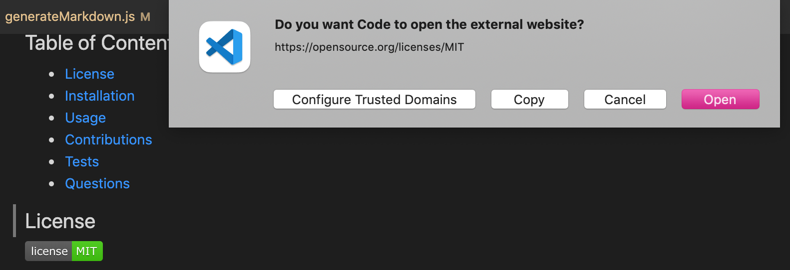

# Readme Generator

## For the user who would like to:
- quickly create a professional README for a new project

## How it works:
1. clone the code
2. open an integrated terminal
3. install npm package
4. type `node index.js`
5. answer questions -- this will provide the data for title, description, license, installation, usage, contributions, testing info, and questions on README
6. Once all questions are answered, the user will see this message: `Readme created! Check out generated-README.md in this directory to see it`
7. When the user open `generated-README.md` file, they will see a created readme based on their inputs as well as the Table of Contents

## Features:
1. npm inquirer package
```javascript
const inquirer = require('inquirer');
const fs = require('fs');
```

2. Uses a badge for license with its info link
```
[](https://opensource.org/licenses/MIT)`
```
### Example:


